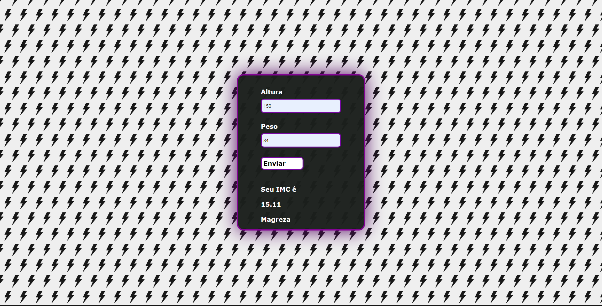

<h1>IMC Calculator</h1>

Um dos meus primeiros projetos "solo" simples e prático, estou criando familiaridade com a sintaxe do JS.
Pretendo deixar responsivo pra tela menores e diminuir esse código do CSS
- HTML, CSS e JS

